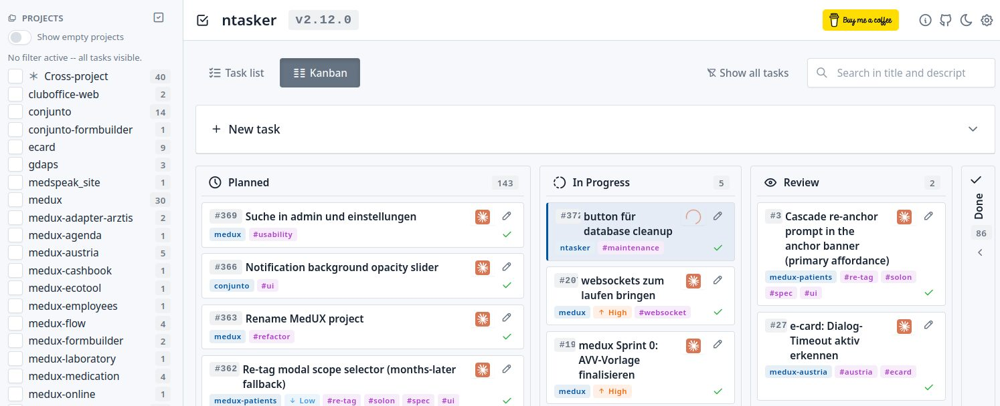
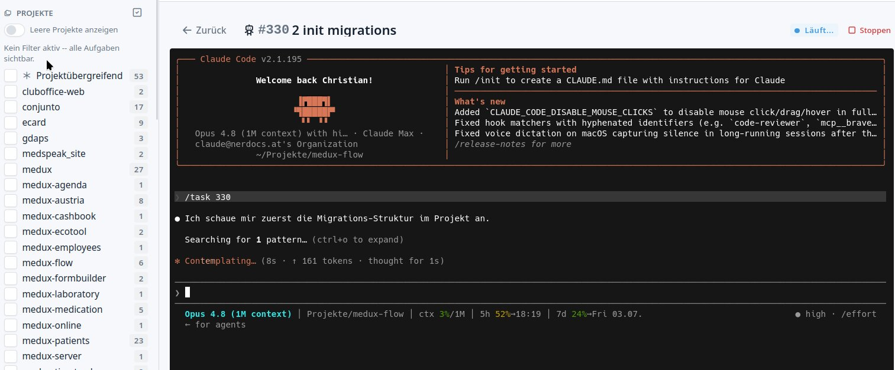

# ntasker

Lightweight local task tracker. Single-user, FastAPI + SQLite, Tabler.io UI.

[](https://buymeacoffee.com/nerdoc)

## In Claude Code

ntasker doubles as Claude's task memory -- the [skill + `/task` command](#claude-code-integration)
let Claude read and drive your tracker, no copy-paste:

- **"What should I work on next?"** -- Claude grabs the open tasks for your current
  project folder and ranks them by urgency.
- **`/task 34`** -- pulls #34 into the session (title, description, tags), flips it to
  *in progress*, and warns you if you're sitting in the wrong project.
- **"Add a todo: ..."** -- Claude files it for you; drop a `#34` anywhere later and it
  knows exactly which task you mean.
- Finished an assigned task? Claude moves it to **Review** for you to sign off -- it
  never closes, deletes, or archives tasks on its own.



## Run with Claude (web UI)

The flip side of the integration above: every task row has a **Run with Claude** button that opens a real interactive
Claude Code session -- the genuine TUI, embedded in the page via xterm.js -- running in the task's project directory
and seeded with `/task <id>`. You answer Claude's questions, approve its tool prompts and interrupt it exactly as in a
terminal; it is the same `claude` binary with the same `CLAUDE.md`, skills, MCP and permissions.

Sessions run in the background (the button shows a spinner, and re-opening reattaches to the live session); marking a
task **done** ends its session. Needs the `claude` CLI on `PATH` and a POSIX pseudo-terminal, otherwise the button
stays hidden. See [docs/claude-runs.md](docs/claude-runs.md).



## Stack

- Backend: FastAPI + uvicorn, Python stdlib `sqlite3`
- Frontend: HTML + AlpineJS + Tabler.io. **Default = jsDelivr CDN at runtime, with
  SRI hashes pinned in `src/ntasker/assets.py`**. Optional fully-offline mode
  via `ntasker assets fetch` (writes into the user-data dir, never into the
  Python wheel). No build step.
- Storage: SQLite at `platformdirs.user_data_dir("nTasker")/tasks.db` by default
  (Linux: `~/.local/share/nTasker/tasks.db`)
- Layout: PyPA src-layout, package `src/ntasker/`, entry point `ntasker = ntasker.cli:main`

## Bind

Default `127.0.0.1:8766`. Do **not** expose this on a network -- there is no auth.
Override via `ntasker serve --host <h> --port <p>` if you really need to.
This is a personal local tool, not a multi-user service.

## DB path resolution

Highest precedence wins:

1. `--db <path>` flag on every CLI invocation.
2. Environment variable `NTASKER_DB`.
3. `platformdirs.user_data_dir("nTasker") / "tasks.db"` (default).

Per-OS defaults:

| OS      | Path                                                     |
|---------|----------------------------------------------------------|
| Linux   | `~/.local/share/nTasker/tasks.db`                        |
| macOS   | `~/Library/Application Support/nTasker/tasks.db`         |
| Windows | `%LOCALAPPDATA%\nTasker\tasks.db`                        |

Only the Linux path is regularly tested; the others are derived via `platformdirs`.

## Setup

Install from PyPI, then run it as a background service that starts at login and restarts on crash -- `systemd --user`
on Linux, `launchd` on macOS. User-scoped, no root:

```bash
uv tool install ntasker                  # install from PyPI
ntasker service install --auto-update    # run as a service + daily auto-update
```

Open <http://127.0.0.1:8766> in a browser. That's it -- the service creates the database on first start, restarts on
crash, and keeps itself up to date.

On Linux, run this once so the service survives logout:

```bash
loginctl enable-linger $USER
```

Manage it later:

```bash
ntasker service status            # install + active state
ntasker service start / stop      # start / stop the installed service
ntasker self-update               # upgrade from PyPI now, then restart
```

Full reference (uninstall, restart, `update_command` override, scheduling): [docs/service.md](docs/service.md).

### Run in the foreground instead

No supervisor -- just run the server until you close it:

```bash
ntasker serve          # http://127.0.0.1:8766, Ctrl-C to stop
```

### Repo-local development

```bash
cd /path/to/ntasker
make install   # uv sync
make run       # uv run ntasker serve --reload
```

## Settings

Required for the project sidebar to populate: configure where your project
symlinks live.

Via UI:  open `/settings` in the browser, fill in `projects_dir`, save.
Via CLI: `ntasker config set projects_dir ~/Projekte`
Via ENV: `NTASKER_PROJECTS_DIR=/path/to/projects ntasker serve` (overrides the DB value).

The validator requires the path to be absolute, exist, be a directory, and be readable.

### How `projects_dir` is interpreted

ntasker tracks a directory. Each immediate subdirectory (or symlink to a
project repo) inside `projects_dir` is exposed as a selectable Project in
the UI sidebar and the `project=` API filter. Tasks can be assigned to
one of these projects (by folder/symlink name) or stay cross-project
(`null`). The directory listing is read on demand on every request --
there is no scan job and no DB-cached project list. Add or remove a
folder/symlink in `projects_dir` and it shows up (or disappears) on the
next reload.

## Localization

ntasker ships with English (default) and German UI strings. Translation
uses the Python stdlib `gettext` module; catalogs live at
`src/ntasker/locale/<lang>/LC_MESSAGES/ntasker.{po,mo}`.

Pick the UI language via the `language` setting:

| Value  | Behaviour                                                            |
|--------|----------------------------------------------------------------------|
| `auto` | Parse the `Accept-Language` HTTP header; fallback English. **Default.** |
| `en`   | Always English.                                                      |
| `de`   | Always German.                                                       |

```bash
ntasker config set language de       # pin to German
ntasker config unset language        # back to auto
NTASKER_LANGUAGE=en ntasker serve    # one-shot ENV override
```

CLI follows: setting > `LANG`/`LC_MESSAGES` env > English.

For development, regenerate catalogs after touching strings:

```bash
make i18n          # extract + update + compile
make i18n-init-de  # bootstrap a fresh language (idempotent)
```

Extraction uses [Babel](https://babel.pocoo.org/) (dev-only dep; runtime
needs only the stdlib). Catalog keywords: `_`, `_lazy`, `t` (Jinja
shorthand), `N_` (no-op marker for module-level constants).

## Vendor assets (CDN default, opt-in offline)

Tabler core CSS, Tabler-Icons webfont, and Alpine.js are loaded from
[jsDelivr](https://www.jsdelivr.com/) by default with [SRI](https://developer.mozilla.org/en-US/docs/Web/Security/Subresource_Integrity)
hashes pinned in `src/ntasker/assets.py`. The wheel ships **no** vendor
binaries -- it stays under 100 KB.

For offline use, populate the user-data cache once:

```bash
ntasker assets fetch    # downloads + verifies SRI for each manifest entry
ntasker assets status   # shows mode + per-asset state
ntasker assets remove --yes  # wipes the cache
```

The cache lives at `platformdirs.user_data_dir("nTasker") / "vendor"`
(Linux: `~/.local/share/nTasker/vendor`). Mode selection is via the
`assets_mode` setting:

| Value   | Behaviour                                                        |
|---------|------------------------------------------------------------------|
| `cdn`   | always load from jsDelivr (with SRI)                             |
| `local` | always load from the user-data cache (must run `assets fetch`)   |
| `auto`  | local if cache is complete, else CDN. **Default.**               |

ENV override: `NTASKER_ASSETS_MODE=cdn ntasker serve`. SRI is emitted in
both modes (catches on-disk tampering for `local` too).

## Claude Code Integration

ntasker ships a Claude Code skill (`SKILL.md`) and slash-command loader (`/task <id>`)
inside the package. The single source of truth lives under
`src/ntasker/claude_assets/` and gets installed into `~/.claude/` via the CLI.

```bash
# Default install: writes SKILL.md, task.md, _ntasker_loader.py
ntasker install-claude-assets

# Status check (exit codes: 0=identical, 1=drift, 2=not installed)
ntasker install-claude-assets --check

# Update after a version bump (creates timestamped .bak.YYYYMMDD-HHMMSS backups)
ntasker install-claude-assets --force

# Use a different slash command name (e.g. /todo instead of /task)
ntasker install-claude-assets --command-name todo

# Dry run -- show planned actions without writing
ntasker install-claude-assets --dry-run

# Test/sandbox: redirect to a non-default Claude home
ntasker install-claude-assets --claude-home /tmp/test-home
# Or via env: NTASKER_CLAUDE_HOME=/tmp/test-home ntasker install-claude-assets
```

The `--command-name` flag accepts only `[A-Za-z0-9_-]+` (no slashes, no dots) to
prevent path traversal. The helper file `_ntasker_loader.py` always keeps that
exact name regardless of the slash command.

`ntasker serve` prints a one-liner to stderr at boot if installed Claude assets
are out of date relative to the running version. The `/settings` UI shows the
same status as a read-only card; there is intentionally no HTTP write endpoint
(installs are user-initiated via the CLI to avoid CSRF / DNS-rebinding write
surface).

## CLI

| Command                     | What it does                                                  |
|-----------------------------|---------------------------------------------------------------|
| `ntasker init`              | Create / migrate the schema at the active DB path             |
| `ntasker serve`             | Run the FastAPI server (defaults: 127.0.0.1:8766)             |
| `ntasker list [filters]`    | List tasks; supports `--project`, `--tag`, `--phase`, ...     |
| `ntasker show <id>`         | Show a single task; pair with `--json` for raw output         |
| `ntasker add --title=...`   | Create a task; optional `--project --phase --priority --tag`  |
| `ntasker done <id>`         | Mark a task as done                                           |
| `ntasker patch <id> [...]`  | Patch arbitrary fields (`--title`, `--phase`, `--status`, ...)|
| `ntasker tag-add <id> <t>`  | Append a tag                                                  |
| `ntasker tag-rm  <id> <t>`  | Remove a tag                                                  |
| `ntasker stats [filters]`   | Tab counts (open/done/archive) honoring filters               |
| `ntasker config list`       | Show all settings                                             |
| `ntasker config get <k>`    | Read a setting                                                |
| `ntasker config set <k> <v>`| Write a setting (validated)                                   |
| `ntasker config unset <k>`  | Remove a setting                                              |
| `ntasker install-claude-assets` | Install / check the Claude Code skill + `/task` slash-command |
| `ntasker assets fetch / status / remove` | Manage the optional local vendor-asset cache |
| `ntasker service install / uninstall / status / start / stop` | Run ntasker as an OS service (systemd / launchd) |
| `ntasker self-update`       | Upgrade the package from PyPI, then restart the service        |

Global flags:

- `--db <path>` -- override the resolved DB path for this invocation.
- `--version` -- print the package version and exit.

Most listing commands accept `--json` for machine-readable output.

## Smoke test

```bash
make smoke
```

Runs an in-process FastAPI test client against a temp DB *and* exercises a
couple of CLI subcommands via subprocess.

## API

| Method | Path | Notes |
|---|---|---|
| GET | `/` | The single-page task UI |
| GET | `/settings` | The settings UI |
| GET | `/api/changes` | Cheap change token (`{v}` = DB file mtime in ns). The UI polls it and refetches only when it changed, so CLI/API writes surface live. See [docs/live-updates.md](docs/live-updates.md). |
| GET | `/api/projects` | `[{name, open_count}]`, `__none__` first; sets `X-Settings-Missing: projects_dir` if unconfigured |
| GET | `/api/tags` | `[{name, open_count}]`, sorted by `open_count DESC, name ASC` |
| POST | `/api/tags/cleanup` | Delete dangling tags (no `task_tags` row). Returns `{removed, removed_names}`. Idempotent. |
| GET | `/api/phases` | `[{value, label, open_count}]`, fixed workflow order: `wip`, `planned`, `later`, `__none__` |
| GET | `/api/priorities` | `[{value, label, open_count}]`, fixed order: `critical`, `high`, `normal`, `low` |
| GET | `/api/tasks` | Filters: `project` (multi), `tag` (multi, OR), `phase` (multi, OR; `__none__` = phase IS NULL), `priority` (multi), `status`, `archived`, `search`. Filters across params combine with **AND**. |
| GET | `/api/tasks/{id}` | Single task incl. `tags` |
| GET | `/api/stats` | Tab counts (`open`/`done`/`archive`), respects all filters |
| POST | `/api/tasks` | `{project?, title, description?, phase?, priority?, tags?}` |
| PATCH | `/api/tasks/{id}` | Any subset of `{title, description, project, phase, priority, status, archived, tags}` -- `tags` is a **full replace** |
| DELETE | `/api/tasks/{id}` | Hard delete (the UI archives by default) |
| GET | `/api/settings` | List all settings rows |
| GET | `/api/settings/{key}` | Single setting or 404 |
| PUT | `/api/settings/{key}` | `{value: "..."}` -- 200 on accept, 400 if a registered validator rejects |
| DELETE | `/api/settings/{key}` | 204 on success, 404 if not present |
| GET | `/api/claude-assets/status` | Read-only: `{installed, drift, package_version, claude_home, files[]}` |

OpenAPI: <http://127.0.0.1:8766/api/docs>

## Schema

```sql
CREATE TABLE tasks (
    id INTEGER PRIMARY KEY AUTOINCREMENT,
    project TEXT,
    title TEXT NOT NULL,
    description TEXT,
    status TEXT NOT NULL DEFAULT 'open',
    phase TEXT,
    priority TEXT NOT NULL DEFAULT 'normal',
    created_at TEXT NOT NULL DEFAULT (datetime('now')),
    completed_at TEXT,
    archived INTEGER NOT NULL DEFAULT 0
);
CREATE TABLE tags (
    id INTEGER PRIMARY KEY AUTOINCREMENT,
    name TEXT NOT NULL UNIQUE COLLATE NOCASE
);
CREATE TABLE task_tags (
    task_id INTEGER NOT NULL REFERENCES tasks(id) ON DELETE CASCADE,
    tag_id  INTEGER NOT NULL REFERENCES tags(id)  ON DELETE CASCADE,
    PRIMARY KEY (task_id, tag_id)
);
CREATE TABLE settings (
    key TEXT PRIMARY KEY,
    value TEXT NOT NULL,
    updated_at TEXT NOT NULL DEFAULT (datetime('now'))
);
```

`status`: `open` | `done`. `phase`: `wip` | `planned` | `later` | NULL.
`priority`: `critical` | `high` | `normal` | `low` (NOT NULL, default `normal`).
Tag names are normalised to lowercase on write; `UNIQUE COLLATE NOCASE` keeps it tidy.

## Design notes

- DB init on startup; pure idempotent `CREATE TABLE IF NOT EXISTS`. Legacy
  columns are dropped or added in `try/except OperationalError` blocks --
  no Alembic, no migration files.
- All SQL parameterised (`?`); no string interpolation.
- Project list is read live each request from the symlinks under the
  configured `projects_dir` -- no caching.
- Sidebar `open_count` values are absolute (always count all open + non-archived
  tasks), so toggling filters does not flicker the sidebar.
- Hard-delete is intentionally rare; archive is the default. Deleting a task
  cascades through `task_tags` but leaves `tags` rows in place (zero-cost dangling).
- Project / phase / tag / priority badges in a task row are clickable: each one
  toggles the matching filter. `@click.stop` prevents the parent row interactions.
- Dates stored as UTC ISO strings, rendered locally via `Intl.RelativeTimeFormat('de-DE')`.

## Project home

GitHub: <https://github.com/nerdocs/ntasker>

## Changelog

See [`CHANGELOG.md`](CHANGELOG.md). Highlights:

- **1.2.0** -- Packaged Claude Code assets generalised (no user-specific routing/paths). AGPL-3.0-or-later license. README explains `projects_dir` semantics. `/task` accepts `#`-prefix. Task-ID click copies `/task #<id>` to clipboard. Existing installs need `ntasker install-claude-assets --force` after upgrade.
- **1.1.0** -- `install-claude-assets` CLI for shipping the Claude Code skill + `/task` slash-command from the package; read-only `/api/claude-assets/status` endpoint and Settings UI card; boot drift warning.
- **1.0.0** -- Renamed `nerdocs-tracker` -> `ntasker`; src-Layout; CLI with subcommands; settings module + UI; configurable `projects_dir`; DB moved to `platformdirs` default. **Breaking.**
- **0.4.0** -- `priority` field with sidebar filter and badge.
- **0.3.x** -- Cache-buster, version badge, archive button polish.

## License

Licensed under the GNU Affero General Public License, version 3 or later
(AGPL-3.0-or-later). See [`LICENSE`](LICENSE) for the full text.

The Affero clause means: if you run a modified version of nTasker as a
network service, you must offer the modified source code to its users.
For local single-user use this has no practical impact.
