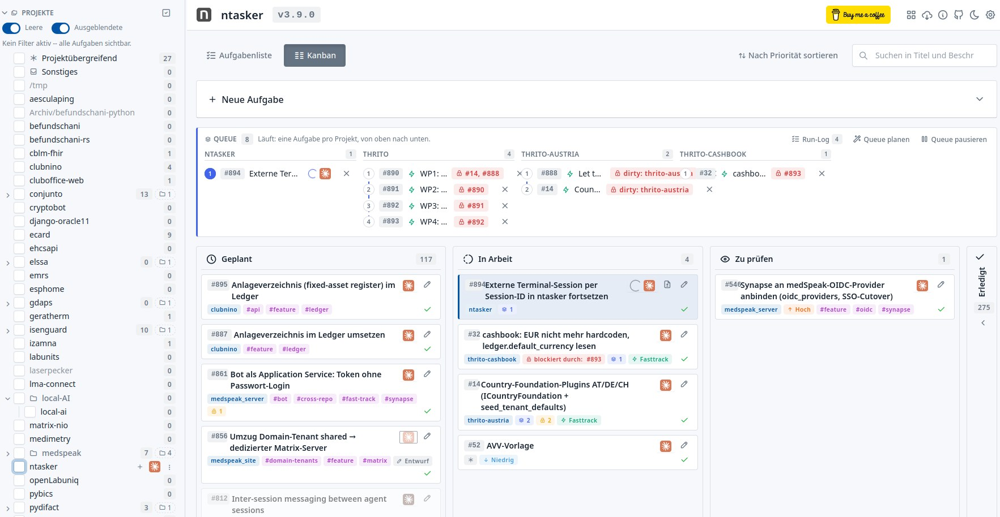
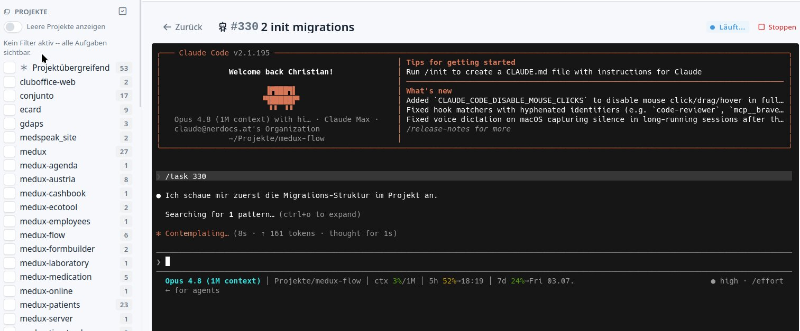

# ntasker

**Put your coding agent on a kanban board.**

Drop your tasks on the board, hit **run**, and Claude Code, OpenCode or Pi picks one up -- in a real terminal embedded
in the page, in that task's project directory, already briefed on the task. A queue works through the rest unattended,
one task per project, while you do something else. Runs on your own machine: one Python package, a SQLite file, no
account, no build step, nothing leaves the box.



## Quickstart

```bash
uv tool install ntasker                  # install from PyPI
ntasker service install --auto-update    # run as a service + daily auto-update
ntasker config set projects_dir ~/Projekte
```

Open <http://127.0.0.1:8766>. The service creates the database on first start, restarts on crash and keeps itself up to
date. On Linux, run `loginctl enable-linger $USER` once so it survives logout. No supervisor wanted? `ntasker serve`
runs it in the foreground until you close it.

Then teach your agent about it:

```bash
ntasker agent install claude     # or: opencode, pi
```

## Why

Three things a plain to-do list cannot do.

### The board is your agent's memory

The installed skill and `/task` command let the agent read and drive the tracker -- no copy-paste, no re-explaining:

- **"What should I work on next?"** -- it grabs the open tasks for your current project folder and ranks them by
  urgency.
- **`/task 34`** -- pulls #34 into the session (title, description, tags), flips it to *in progress*, and warns you if
  you are sitting in the wrong project.
- **"Add a todo: ..."** -- it files the task for you; drop a `#34` anywhere later and it knows which task you mean.
- Finished an assigned task? It moves the task to **Review** for you to sign off. It never closes, deletes or archives
  anything on its own.

### Run a task without leaving the board

Every task row has a **run** button showing that task's agent logo. It opens the genuine TUI, embedded in the page via
xterm.js, running in the task's project directory and seeded with the task. You answer the agent's questions, approve
its tool prompts and interrupt it exactly as in a terminal -- same CLI, same `CLAUDE.md`, same skills, MCP and
permissions.

Sessions run in the background (the button shows a spinner; re-opening reattaches to the live session), and marking a
task **done** ends its session. An open task whose session already ended gets a **resume** button next to Run, which
continues that conversation instead of starting over. The button only appears when the agent's CLI resolves and a POSIX
pseudo-terminal is available. See [docs/claude-runs.md](docs/claude-runs.md).



### The queue keeps going when you stop watching

Every run button puts its task at the head of its project's lane, and ntasker works through the queue one task per
project at a time, taking the next one as soon as the previous is closed -- by you after review, or by the agent when
the task told it to. `done` is the only thing that ends a session. **Pause** stops new starts; running tasks keep going.

The panel shows one column per project, because that is what runs in parallel. To make one task wait for another --
across projects too -- drop it on the **middle** of the other; the edges keep reordering. A **fasttrack** task commits
and closes itself and hands its result to the tasks depending on it; the **Run-Log** collects those outcomes. **Plan
queue** lets an agent session order the queue for you and start it. See [docs/task-queue.md](docs/task-queue.md).

### The inbox sorts your ideas

Type a raw thought into the topbar field (`Ctrl+K`) or `ntasker in "..."` and carry on. A stateless `claude -p` call
turns it into a proposed task -- title, prompt, priority, tags and the project, chosen from a catalog of one-paragraph
project summaries -- and the Inbox column shows the proposal with project chips. One click accepts it, a chip accepts
it elsewhere, and every correction becomes an example for the next triage. Nothing becomes a task until you say so.
See [docs/inbox.md](docs/inbox.md).

## Pick your agent per task

ntasker is agent-agnostic: **Claude Code, OpenCode and Pi** are supported out of the box, and adding another is one
plugin. Each task carries an `agent` and an optional `model`; either can fall back to a global default.

```bash
ntasker add --title "..." --agent opencode --model opus
ntasker config set default_agent opencode
ntasker agent list                             # CLI availability + integration status per agent
```

Full reference incl. per-agent binary paths: [docs/agents.md](docs/agents.md).

## Plugins

Optional features ship as plugins you can switch off individually (`/settings` -> *Plugins*):

| Plugin         | What it adds                                                                                     |
|----------------|---------------------------------------------------------------------------------------------------|
| `task_context` | Attach files, notes, personas, skills and MCP servers to a task, handed to the agent in its briefing ([docs](docs/task-context.md)) |
| `workspace`    | Team (Claude Code subagents), skills, knowledge base and documents on a `/workspace` page ([docs](docs/workspace.md)) |
| `voice`        | Dictate task descriptions with local speech recognition; opt-in via `ntasker enable voice` ([docs](docs/voice.md)) |

A disabled plugin's routes 404, its agent is neither listed nor resolvable, and its data stays intact. Contract and
slots: [docs/plugins.md](docs/plugins.md).

## Documentation

| Topic | |
|---|---|
| [Configuration](docs/configuration.md) | Settings, DB path, `projects_dir`, language, vendor assets, **why you must not expose the port** |
| [CLI reference](docs/cli.md) | Every subcommand and flag |
| [HTTP API](docs/api.md) | Endpoints, SQLite schema, design notes |
| [Agents](docs/agents.md) | The agent registry, per-task model, skill installation |
| [Agent runs](docs/claude-runs.md) | How an embedded session is spawned and reattached |
| [Task queue](docs/task-queue.md) | Queue semantics, dependencies, fasttrack, run log |
| [Directory locks](docs/directory-locks.md) | Keeping two agents out of the same working directory |
| [Kanban view](docs/kanban.md) | Board vs. list view, drag-and-drop, keyboard shortcuts |
| [Inbox](docs/inbox.md) | Raw notes triaged into task proposals by a stateless `claude -p` call |

| [Projects](docs/projects.md) | Sidebar tree, project families, misc project |
| [Service](docs/service.md) | systemd / launchd, auto-update, uninstall |
| [Development](docs/development.md) | Repo setup, smoke test, translations |

Coming from the drfoehn fork? See [docs/migrating-from-fork.md](docs/migrating-from-fork.md).

## Stack

FastAPI + uvicorn on the Python stdlib `sqlite3` -- no ORM, no migration files. The frontend is HTML + AlpineJS +
Tabler.io loaded from jsDelivr with pinned SRI hashes, so the wheel stays under 100 KB and there is no build step; an
offline mode is one command away. Requires Python 3.12+.

Binds to `127.0.0.1:8766` and has **no authentication** -- it is a personal local tool, not a multi-user service.

## License

[AGPL-3.0-or-later](LICENSE). The Affero clause means: if you run a modified version as a network service, you must
offer the modified source to its users. For local single-user use this has no practical impact.

Changelog: [CHANGELOG.md](CHANGELOG.md) -- issues and source: <https://github.com/nerdocs/ntasker>

If it saves you an afternoon, you can [buy me a coffee](https://buymeacoffee.com/nerdoc).
